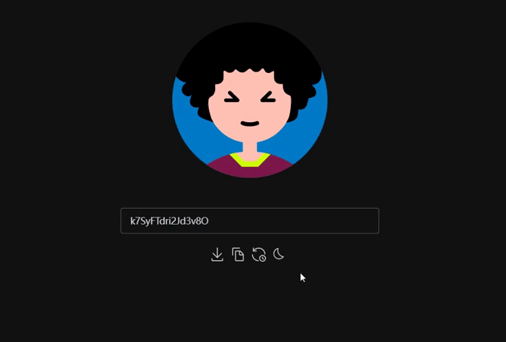

# Random Avatar
Get an avatar by entering a string.

> Example

> USAGE

Enter any string in the input field and wait only a few seconds to get the avatar.
If you do not like the generated avatar, you can choose to modify the string or click the random refresh button to wait for it to be generated again.

> Copy && Download

If you like the resulting avatar, you can click the Copy Link button to copy the avatar link or click the Download button to download the avatar to your computer.
